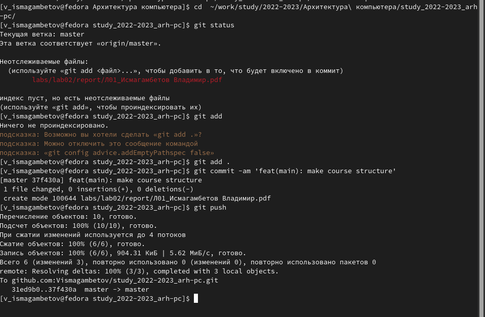

---
## Front matter
title: "Лабораторная работа №2"
subtitle: "Система контроля GIT"
author: "Исмагамбетов Владимир Сергеевич"

## Generic otions
lang: ru-RU
toc-title: "Содержание"

## Bibliography
bibliography: bib/cite.bib
csl: pandoc/csl/gost-r-7-0-5-2008-numeric.csl

## Pdf output format
toc: true # Table of contents
toc-depth: 2
lof: true # List of figures
lot: true # List of tables
fontsize: 12pt
linestretch: 1.5
papersize: a4
documentclass: scrreprt
## I18n polyglossia
polyglossia-lang:
  name: russian
  options:
	- spelling=modern
	- babelshorthands=true
polyglossia-otherlangs:
  name: english
## I18n babel
babel-lang: russian
babel-otherlangs: english
## Fonts
mainfont: PT Serif
romanfont: PT Serif
sansfont: PT Sans
monofont: PT Mono
mainfontoptions: Ligatures=TeX
romanfontoptions: Ligatures=TeX
sansfontoptions: Ligatures=TeX,Scale=MatchLowercase
monofontoptions: Scale=MatchLowercase,Scale=0.9
## Biblatex
biblatex: true
biblio-style: "gost-numeric"
biblatexoptions:
  - parentracker=true
  - backend=biber
  - hyperref=auto
  - language=auto
  - autolang=other*
  - citestyle=gost-numeric
## Pandoc-crossref LaTeX customization
figureTitle: "Рис."
tableTitle: "Таблица"
listingTitle: "Листинг"
lofTitle: "Список иллюстраций"
lotTitle: "Список таблиц"
lolTitle: "Листинги"
## Misc options
indent: true
header-includes:
  - \usepackage{indentfirst}
  - \usepackage{float} # keep figures where there are in the text
  - \floatplacement{figure}{H} # keep figures where there are in the text
---

# Цель работы

1. Ознакомиться с системой контроля версий GIT
2. Создать рабочее окружение для дальнейших лабораторных
работ
3. Изучить идеологию применения средств контроля версий

# Выполнение лабораторной работы

1. Базовая настройка GIT
1.1 Мы устанавливаем имя пользователя,почту и изменили название ветки (рис. [-@fig:001])

{ #fig:001 width=70% }

2.Генерация пары SSH ключей
2.1 Переходим в директорию ~/.ssh и сгенерируем пару ключей (рис. [-@fig:001])

{ #fig:001 width=70% }

3. Добавляем публичный ключ в аккаунт на GitHub рис. [-@fig:001])

{ #fig:001 width=70% }

3.1 Перейдем во вкладку SSH and GPG keys на Github, и нажмем New
SSH key
3.2 Добавляем публичный ключ
3.3 Создадим новый репозиторий из шаблона (рис. [-@fig:001])

{ #fig:001 width=70% }

3.4 Склонируем репозиторий на свой компьютер (рис. [-@fig:001])

{ #fig:001 width=70% }

([-@fig:001])

{ #fig:001 width=70% }

Репозиторий склонировался на нашу локальную машину
3.5 Перейдем в каталог с репозиторием и просмотрим его содержимое и
удалим файл package.json и создадим файл COURSE содержащий текст
«arch-pc» 9. Исполним команду make что бы выполнить команды из
Makefile (рис. [-@fig:001])

{ #fig:001 width=70% }

3.6 Отправим файлы на сервер. Добавим изменения коммандой git add,
закоммитим их и отправим на сервер (рис. [-@fig:001])

{ #fig:001 width=70% }

([-@fig:001])

{ #fig:001 width=70% }

([-@fig:001])

{ #fig:001 width=70% }

# Задания для самостоятельной работы
1.Зайдем в локальный репозиторий
2. Исполним комадну git add . И посмотрим, какие изменения будут
закоммичены
3. Закоммитим изменения
4. Запушим изменения
([-@fig:001])

{ #fig:001 width=70% }

# Выводы

В ходе лабораторной работы мы ознакомились с системой контроля версий GIT, узнали разницу между централизованным VCS и распределенными (такими как GIT), Создали репозиторий из шаблонана сервисе GitHub и внесли в него некоторые изменения. Мы освоили базовые команды утилиты git и создали рабочее пространство для
следующих лабораторных работ.		

::: {#refs}
:::
